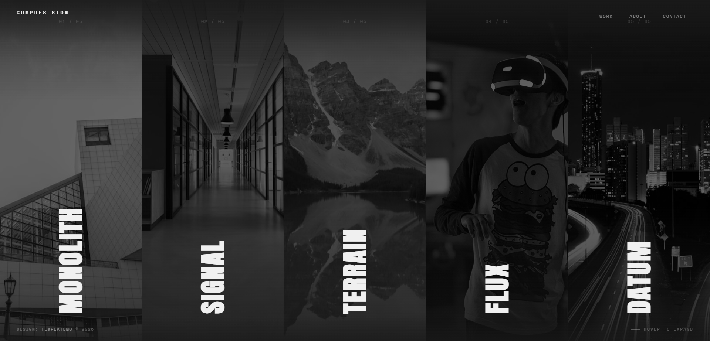
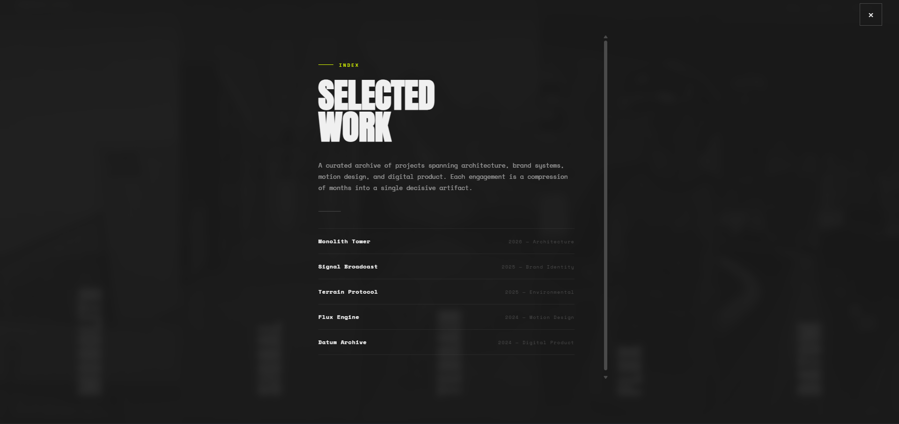
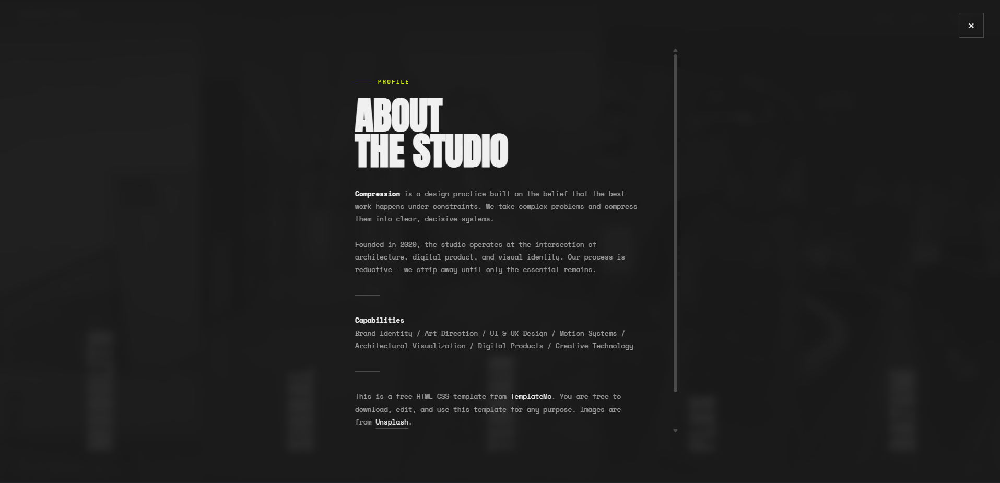

# Axis Industrial

Axis Industrial kompaniyasi uchun ishlab chiqilgan rasmiy veb-sayt. Ushbu loyiha Django framework yordamida yaratilgan.

## 📸 Loyihadan lavhalar

| Asosiy sahifa | Xizmatlar sahifasi | Kontaktlar sahifasi |
| :--- | :--- | :--- |
|  |  |  |


## 🚀 Loyihani ishga tushirish

Loyihani mahalliy muhitda (local machine) ishga tushirish uchun quyidagi bosqichlarni bajaring:


### 1. Repozitoriyni klonlash
```bash
git clone <sizning-repo-linkiniz>
cd axis-industrial

```

### 2. Virtual muhitni sozlash

Virtual muhitni yaratish va faollashtirish:

**Windows uchun:**

```bash
python -m venv venv
venv\Scripts\activate

```

**macOS/Linux uchun:**

```bash
python3 -m venv venv
source venv/bin/activate

```

### 3. Bog'liqliklarni o'rnatish

```bash
pip install -r requirements.txt

```

### 4. Bazani migratsiya qilish

```bash
python manage.py migrate

```

### 5. Administrator yaratish

```bash
python manage.py createsuperuser

```

### 6. Serverni ishga tushirish

```bash
python manage.py runserver

```

Saytga `http://127.0.0.1:8000/` manzili orqali kirishingiz mumkin.

---

## 📸 Loyihadan lavhalar

Quyida saytning asosiy sahifalari keltirilgan:

---

## 🛠 Texnologiyalar

* **Backend:** Django
* **Database:** SQLite (yoki o'zingiz ishlatayotgan baza)
* **Frontend:** HTML, CSS, JavaScript

## 📧 Bog'lanish

Agar savollaringiz bo'lsa yoki loyiha bo'yicha takliflaringiz bo'lsa, men bilan bog'lanishingiz mumkin.